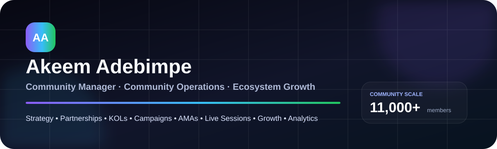
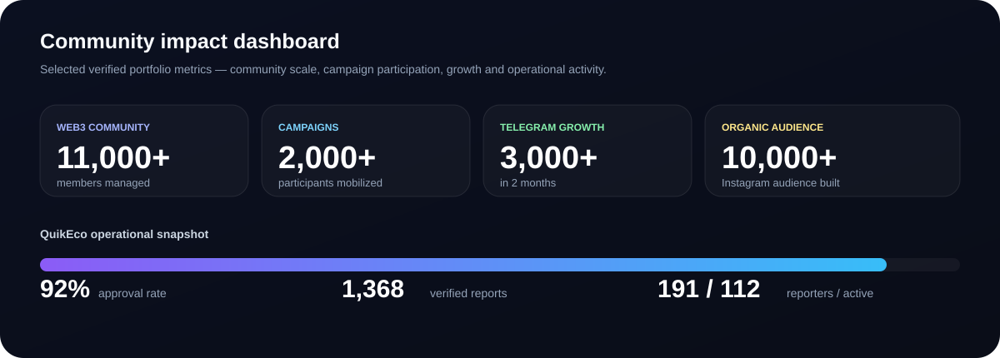
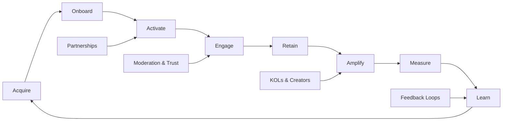

 

---

## Community impact at a glance

> I build **community ecosystems**, not just chat rooms: strategy, programs, partnerships, campaigns, KOL relationships, acquisition, activation, retention, moderation, contributor systems and feedback loops.

---

## Achievement dashboard

| Area | Achievement / proof |
|---|---|
| **Community scale** | Managed an international Web3 community of **11,000+ members** |
| **Campaign activation** | Mobilized **2,000+ participants** across coordinated community campaigns |
| **Telegram growth** | Grew a Telegram community by **3,000+ members in 2 months** |
| **Organic social growth** | Built an organic Instagram audience of **10,000+** |
| **Community operations** | QuikEco operations dashboard shows **191 reporters**, **112 active reporters**, **1,368 verified reports** and **92% approval** |
| **KOL / influencer relations** | Built relationships with KOLs, influencers and external community voices at Dogelon Mars |
| **Partnership development** | Directly initiated and developed the **VoltFX affiliate partnership** through TradesbyTCG |
| **Ecosystem activation** | Supported community-facing collaboration activity involving **Wintermute** and **BloFin** |
| **Live programming** | Organized/supported **AMAs, community events and interactive sessions** |
| **AI + Web3** | Supported BlockInsight AI through moderation, onboarding, education, sentiment collection and ecosystem engagement |
| **Lifecycle growth** | Supported acquisition, onboarding, engagement and retention across LearnTechNow |
| **Moderation & trust** | Managed conflict, guidelines, spam prevention, support and community health across multiple ecosystems |

---

## What I am strongest at

<table>
<tr>
<td width="33%" valign="top">

### Strategy & Growth
- Community strategy
- Community-led growth
- User acquisition
- Activation systems
- Retention & reactivation
- Contributor programs
- Campaign planning

</td>
<td width="33%" valign="top">

### Ecosystem & Influence
- Partnerships
- KOL / influencer outreach
- Ambassador systems
- Ecosystem collaboration
- Affiliate partnerships
- Community amplification
- Stakeholder relationships

</td>
<td width="33%" valign="top">

### Operations & Programming
- AMAs
- Live sessions
- Moderation
- Onboarding
- Feedback loops
- Escalation management
- Reporting & analytics

</td>
</tr>
</table>

---

## Featured experience

### QuikEco — Community Operations Lead

**Focus:** community operations · contributor systems · onboarding · activation · feedback · reporting

- Built and operated a community ecosystem connecting users, reporters and community handlers.
- Developed community strategies designed to move members from awareness into consistent participation.
- Designed campaigns, challenges and activation initiatives to re-engage members and stimulate reporting activity.
- Developed contributor and community-handler structures.
- Built feedback loops between users and operations.
- Coordinated recruitment, onboarding, contributor management and weekly performance tracking.

**Visible operating proof:** **191 reporters · 112 active · 1,368 verified reports · 92% approval rate**

---

### Dogelon Mars ($ELON) — Senior Community Manager & Moderator

**Focus:** growth · campaigns · KOLs · AMAs · partnerships · ecosystem activation

- Developed and executed community growth strategies.
- Planned campaigns, giveaways, activations and engagement initiatives.
- Organized and supported AMAs, community events and interactive programming.
- Built relationships with KOLs, influencers and external community voices.
- Developed KOL acquisition and outreach initiatives.
- Coordinated community-driven amplification campaigns across X.
- Supported partnership and ecosystem initiatives.
- Supported awareness and activation around ecosystem collaboration involving Wintermute and BloFin.

---

### TradesbyTCG — Founder & Community Lead

**Focus:** community growth · partnerships · content distribution · trading education

- Built and nurtured an engaged trading community.
- Created community-led growth campaigns and social distribution systems.
- Identified strategic brand and affiliate partnership opportunities.
- **Initiated and developed the VoltFX affiliate partnership through direct outreach.**
- Supported partner activation through social media promotion, community communication and content distribution.

---

### BlockInsight AI ($BIAI) — Senior Community Moderator & Ecosystem Contributor

**Focus:** AI/Web3 · moderation · onboarding · education · feedback · engagement

- Moderated community discussions around AI-powered blockchain analytics.
- Onboarded new members and answered community questions.
- Worked with moderators and leaders to enforce guidelines and resolve conflicts.
- Promoted product and ecosystem awareness through educational engagement.
- Gathered sentiment and recurring community feedback.
- Supported campaigns and ecosystem initiatives that improved participation and visibility.

---

### LearnTechNow — B2C Growth Specialist & Community Success Partner

**Focus:** acquisition · onboarding · lifecycle engagement · conversion · retention

- Built community experiences that moved prospective learners from interest to participation.
- Developed growth initiatives to turn conversations into qualified leads and program participation.
- Supported campaigns, launches and educational initiatives.
- Managed member relationships and follow-ups.
- Gathered learner feedback and surfaced recurring community needs.

---

## My community operating system

---

## Platforms & tools

**Also:** WhatsApp · Slack · Instagram · Facebook · Trello · Asana · ClickUp · HubSpot · Google Workspace · Google Sheets · Microsoft Excel · CapCut · ChatGPT · CoinMarketCap · Etherscan · DEXTools

---

## GitHub activity — real, live data

> The GitHub activity section is intentionally **live and truthful**. As I publish portfolio work, documentation, strategy assets and real projects, the contribution history grows naturally.

---

## Recruiter shortcut

If you are hiring for any of these, start here:

| Role | Why I fit |
|---|---|
| **Community Manager / Lead** | Strategy + day-to-day operations + campaigns + moderation |
| **Community Operations** | Systems, onboarding, contributor structures, feedback loops, reporting |
| **Ecosystem / Partnerships** | Partnership support, affiliate outreach, KOL relationships, amplification |
| **Web3 Community** | Dogelon Mars, BlockInsight AI, X campaigns, ecosystem engagement |
| **Community Growth** | Acquisition, activation, retention, campaigns, social distribution |
| **Moderator / Live Community** | AMAs, live sessions, escalation, community safety and member support |

---

## Explore the full portfolio

### [adebimpe476.github.io/akeem-community-portfolio](https://adebimpe476.github.io/akeem-community-portfolio/)

**Open to remote Community Management · Community Operations · Ecosystem Growth · Community Strategy opportunities**

Nigeria · Remote worldwide

