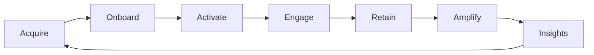

# Akeem Adebimpe

### Community Manager · Community Operations · Community Growth

**I build the systems behind communities — strategy, programs, campaigns, partnerships, KOL relationships, onboarding, activation, retention and community-led growth.**

---

## What I do

I work at the intersection of **community strategy, operations and growth** across Web3, AI, technology education and emerging digital ecosystems.

My work goes beyond moderation. I design the structures that move people from **awareness → onboarding → participation → retention → advocacy**, while connecting community activity to campaigns, partnerships, product feedback and measurable growth.

### Core strengths

`Community Strategy` · `Community Operations` · `Community Growth` · `Partnerships` · `KOL / Influencer Relations` · `Campaigns` · `AMA Hosting` · `Live Sessions` · `Member Onboarding` · `Activation` · `Retention` · `Moderation` · `Feedback Loops` · `Analytics`

---

## Selected impact

| Impact | Result |
|---|---:|
| International Web3 community managed | **11,000+ members** |
| Community participants mobilized for campaigns | **2,000+** |
| Telegram community growth | **3,000+ in 2 months** |
| Organic Instagram audience built | **10,000+** |
| QuikEco community reporting environment | **191 reporters / 112 active** |
| QuikEco verified reports visible in operations dashboard | **1,368** |
| QuikEco approval rate visible in operations dashboard | **92%** |

---

## Featured experience

### QuikEco — Community Operations Lead
Built and operated community systems connecting users, reporters and community handlers. Developed community strategy, onboarding, contributor structures, activation campaigns, feedback loops and weekly participation tracking.

### Dogelon Mars ($ELON) — Senior Community Manager & Moderator
Led community growth initiatives, campaigns, giveaways and activations; supported AMAs and interactive programs; worked with KOLs, influencers and external community voices; and supported ecosystem-facing partnership communication and activation.

### TradesbyTCG — Founder & Community Lead
Built community-led growth systems across trading education and social channels. Identified strategic partnership opportunities and directly initiated the **VoltFX affiliate partnership**, then supported activation through community communication and content distribution.

### BlockInsight AI ($BIAI) — Senior Community Moderator & Ecosystem Contributor
Supported an AI-powered blockchain analytics ecosystem through moderation, onboarding, member education, engagement, conflict resolution, community sentiment collection and ecosystem initiatives.

### LearnTechNow — B2C Growth Specialist & Community Success Partner
Supported learner acquisition, onboarding, lifecycle engagement, relationship management, community campaigns and feedback-driven improvements across a technology education ecosystem.

---

## Community operating model

I connect growth, moderation, education, recognition, campaigns and feedback into one repeatable operating loop.

---

## Platforms & tools

**Community:** Discord · Telegram · WhatsApp · Slack · X / Twitter · LinkedIn · Instagram · Facebook · YouTube

**Operations:** Notion · Trello · Asana · ClickUp · HubSpot · Google Workspace · Google Sheets · Microsoft Excel

**Content & analytics:** Canva · CapCut · Google Analytics · X Analytics · ChatGPT

**Web3:** CoinMarketCap · Etherscan · DEXTools

---

## Featured portfolio

### [Akeem Community Portfolio →](https://adebimpe476.github.io/akeem-community-portfolio/)

A recruiter-facing portfolio with real community proof, case studies and positioning across community strategy, partnerships, KOLs, campaigns, AMAs, moderation, onboarding, retention, AI/Web3 ecosystems and analytics.

---

**Open to remote Community Management · Community Operations · Ecosystem Growth · Community Strategy opportunities**

📍 Nigeria · 🌍 Remote

